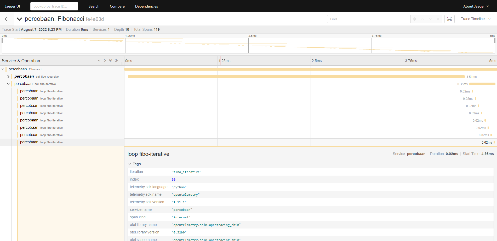

# Jaeger Example

Example of using Jaeger for tracing.

In this example, I compare two approaches to calculating the Fibonacci number:

- recursive
- iterative

An iterative approach is indeed faster than the recursive approach. By using jaeger, you will be able to see the reason.

Although this is a very simple example, Jaeger's capability is more than that. Jaeger can do distributed tracing.

# Prerequisites

- Docker
- Python 3.9 + Venv

# How to start

## First terminal

```bash
# start jaeger
./start-jaeger.sh
```
## Second terminal

```bash
# create venv
python -m venv venv
# activate venv
source venv/bin/activate
# install pip packages
pip install -r requirements.txt

# start python app
python fibo.py
```

# Reading Jaeger UI

Open jaeger UI at `http://localhost:16686`, choose `percobaan` service:



# Further reading

- [https://www.jaegertracing.io/docs/1.37/](https://www.jaegertracing.io/docs/1.37/)
- [open telemetry docs](https://opentelemetry.io/docs/instrumentation/python/getting-started/)
